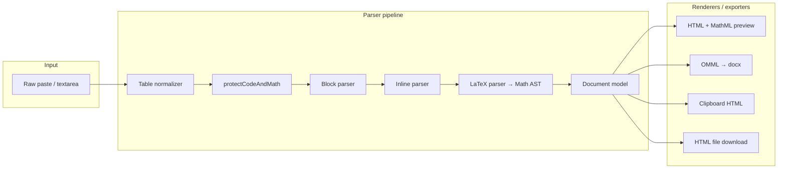

# Developer Guide — LaTeX to Word

This document describes the architecture, module layout, and extension points for contributors to [LaTeX to Word](https://github.com/Lionelapex/latex-to-word).

For MVP design rationale and library choices, see [TECH.md](TECH.md) (architecture decision record).

---

## Architecture

The **document model** is the single source of truth. Preview, clipboard export, and DOCX export are independent renderers over the same tree.



**Critical rule:** Never convert LaTeX → HTML → Word. LaTeX becomes a **Math AST**, then **MathML** (preview) and **OMML** (Word) in parallel. Equations are never exported as images.

---

## Folder structure

```
math-to-word/
├── app.js                 # UI wiring, convert / export handlers
├── index.html             # App shell and controls
├── styles.css
├── vite.config.js         # Vite base path, Vitest config
├── run-dev.bat / .ps1     # Windows dev helpers
├── src/
│   ├── parser/
│   │   ├── index.js           # parseDocument entry
│   │   ├── markdown-parser.js # orchestrates hydrate → document
│   │   ├── protect.js         # code + math delimiter protection
│   │   ├── math-detector.js   # smart mode heuristics
│   │   ├── block-parser.js    # headings, lists, tables, quotes, …
│   │   ├── inline-parser.js   # emphasis, code, math placeholders
│   │   ├── latex-parser.js    # LaTeX → Math AST
│   │   ├── tokenizer.js       # LaTeX token stream
│   │   └── table-normalizer.js# HTML / TSV → GFM pipes
│   ├── model/
│   │   ├── document-model.js  # document tree + stats
│   │   └── math-ast.js        # AST node constructors + walkers
│   ├── renderers/
│   │   ├── html-renderer.js   # preview DOM
│   │   ├── mathml-renderer.js # AST → MathML
│   │   └── omml-renderer.js   # AST → docx Math* / raw OMML
│   ├── exporters/
│   │   ├── docx-exporter.js   # document model → .docx blob
│   │   ├── clipboard-exporter.js
│   │   └── html-exporter.js
│   ├── ui/
│   │   ├── editor.js          # cursor insert helper
│   │   ├── preview.js         # (reserved)
│   │   └── notifications.js
│   └── utils/
│       ├── clipboard.js
│       ├── validation.js
│       └── xml.js
├── tests/                 # Vitest suites
└── docs/
    ├── USER_GUIDE.md
    ├── DEVELOPER.md       # this file
    └── TECH.md            # decision record
```

---

## Data flow

### 1. Entry: `parseDocument(input, { mode })`

Defined in `src/parser/markdown-parser.js`, exported from `src/parser/index.js`.

1. **`normalizePlainTableSource`** — pre-processes tab/line-separated tables in plain text.
2. **`protectCodeAndMath`** — replaces fenced code, inline code, and delimited (and optionally smart) math with opaque placeholders (`\uE000index\uE001`).
3. **`parseBlocks`** — Markdown block structure on placeholder-safe text.
4. **`hydrateBlock`** — resolves placeholders via `parseInlines` + `parseLatex`, builds typed blocks (`heading`, `paragraph`, `list`, `table`, `math`, …).
5. **`createDocument`** — attaches `{ converted, warnings, failed }` stats by walking math nodes.

### 2. Math slots

Each protected math region becomes a slot `{ kind: "math", display, source, delimiter }`. `parseMathSlot` calls `parseLatex(source)` and stores the AST on an inline or block `math` node.

### 3. Export paths

| Exporter | Module | Output |
| --- | --- | --- |
| Preview | `html-renderer.js` + `mathml-renderer.js` | DOM with `<math>` elements |
| DOCX | `docx-exporter.js` + `omml-renderer.js` | `Packer.toBlob()` |
| Clipboard | `clipboard-exporter.js` | `text/html` + `text/plain` |
| HTML file | `html-exporter.js` | Standalone HTML string |

---

## Key modules

### `protect.js`

Order of protection:

1. Fenced code blocks
2. Inline `` `code` ``
3. `\[ \]`, `$$ $$`, `\( \)`, `$ $`, heuristic `[ ]`
4. Smart detection (`findSmartMath`) when `mode === "smart"`

### `latex-parser.js`

Recursive descent parser over `tokenizer.js` tokens. Builds nodes from `math-ast.js`: `fraction`, `sqrt`, `accent`, `nary`, `matrix`, `delimiter`, `failed`, etc.

Unknown commands become `failed` subtrees or partial trees with `containsFailed()` — source text is preserved.

### `omml-renderer.js`

Maps AST types to `docx` library classes (`MathFraction`, `MathRadical`, `MathSum`, …). Gaps (accents, matrices, `\prod`, some delimiters) use **`ImportedXmlComponent`** with hand-written OMML XML fragments serialized from the same AST walk.

### `document-model.js`

`collectStats` classifies each `math` node:

- **failed** — AST is `failed` or missing
- **warnings** — AST parses but `containsFailed()` is true
- **converted** — otherwise

---

## Running tests

```bash
npm test              # vitest run (CI mode)
npm run test:watch    # watch mode
```

Vitest is configured in `vite.config.js` with `environment: "node"` and `tests/**/*.test.js`.

| Suite | Focus |
| --- | --- |
| `tests/latex/parser.test.js` | LaTeX → AST |
| `tests/detection/smart.test.js` | Smart vs strict detection |
| `tests/markdown/*.test.js` | Blocks, lists, tables, MathML |
| `tests/omml/structure.test.js` | OMML XML shape |
| `tests/docx/smoke.test.js` | ZIP/XML smoke on generated `.docx` |
| `tests/fixtures/realistic.test.js` | End-to-end fixture documents |

Helpers: `tests/helpers/xml-assertions.js`, `tests/helpers/unzip.js`.

---

## Adding a LaTeX construct

Typical path: **tokenizer (if needed) → parser → AST node → MathML renderer → OMML renderer → tests**.

### 1. AST (`src/model/math-ast.js`)

Add a constructor if a new node type is needed, and extend `containsFailed` / `walkMath` key lists if the node has child fields.

### 2. Parser (`src/parser/latex-parser.js`)

Handle the command or syntax in `parseCommand()` or `parseAtom()`. Return an AST node or `failed(source, message)` on error.

For smart detection of a new command, add it to `KNOWN_MATH_COMMANDS` in `math-detector.js`.

### 3. MathML (`src/renderers/mathml-renderer.js`)

Implement rendering for the new AST `type` so preview matches intent.

### 4. OMML (`src/renderers/omml-renderer.js`)

- Prefer native `docx` `Math*` classes when available.
- Otherwise add a `serialize()` case and OMML XML template, returned via `ImportedXmlComponent`.

### 5. Tests

Add cases to `tests/latex/parser.test.js`, and if export-critical, `tests/omml/structure.test.js` and/or `tests/markdown/mathml.test.js`.

**Example flow for `\foo{…}`:**

```
parseCommand("foo") → foo(node)
  → appendMathML(case "foo")
  → flatten(case "foo") → MathRun or hatch(serialize(foo))
  → expect(parseLatex("\\foo{x}")).not.toBe("failed")
```

---

## GitHub Pages and Vite base path

`vite.config.js`:

```js
export default defineConfig({
  base: "/latex-to-word/",
  // ...
});
```

All asset URLs in production builds are prefixed with `/latex-to-word/`. The site must be served at:

`https://lionelapex.github.io/latex-to-word/`

Local dev uses `/` on the Vite dev server; only production builds need the base path.

Deployment: `.github/workflows/pages.yml` runs `npm ci`, `npm run build`, uploads `dist/`, and deploys via `actions/deploy-pages`.

---

## Dependencies

| Package | Role |
| --- | --- |
| **`docx`** | Build `.docx`, native `Math*` OMML classes, `Packer.toBlob()` in browser |
| **`xml-js`** | Parse/generate OMML XML fragments for `ImportedXmlComponent` |
| **`vite`** | Dev server and production bundling |
| **`vitest`** | Unit and integration tests |
| **`jszip`** (dev) | Unzip `.docx` in tests for XML assertions |

**Intentionally not used:** KaTeX, MathJax, Temml, markdown-it, server-side conversion, or `mathml2omml` as the primary path. Preview MathML is built directly from the internal AST.

---

## UI layer (`app.js`)

- Loads sample statistics content on first visit.
- **`convert()`** — `parseDocument` → `renderPreview` → stats.
- Paste handler calls **`normalizePastedContent`** for HTML tables.
- Export buttons lazy-call **`convert()`** if no document is cached.
- **`downloadBlob`** triggers browser download for `.docx` / `.html`.

---

## Coding conventions

- ES modules throughout (`"type": "module"` in `package.json`).
- No framework — vanilla DOM APIs.
- Failed math is always visible; never swallow user source.
- Prefer extending existing walkers (`walkBlocks`, `walkMath`) over ad hoc tree traversal.

---

## Related docs

- [USER_GUIDE.md](USER_GUIDE.md) — end-user instructions
- [TECH.md](TECH.md) — MVP verdict, rejected alternatives, acceptance criteria
