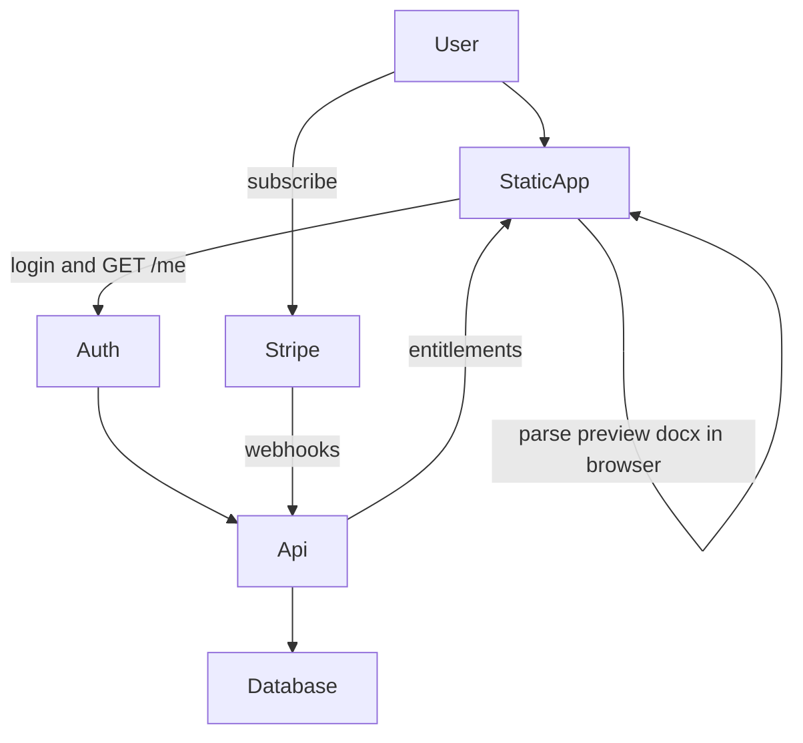

# SaaS architecture

Status: **partial** — Supabase Auth client + UI in the Vite app; Stripe / entitlements API still planned. Conversion remains 100% client-side.

## Principle

**Paste never needs to leave the browser.** The backend answers: “who is this, what plan, how many conversions left?” It does not parse LaTeX.

## Pieces

| Piece | Job | Notes |
| --- | --- | --- |
| Static app | Converter UI + `docx` in the browser | Same Vite app; GitHub Pages or Cloudflare/Netlify |
| Auth | Login (email + password v1) | **Supabase Auth** via `@supabase/supabase-js` (anon key only). See [AUTH.md](AUTH.md) and DECISIONS.md |
| Database | User id, plan, period end, usage counters | Supabase (or later API DB); Do **not** store pasted documents |
| Stripe | Checkout + Customer Portal | Webhooks update plan; never handle raw cards |
| Small API | `GET /me`, optional `POST /usage` | No LaTeX body required; service_role / Stripe secrets **only on server** |

## Entitlements (app)

After Convert (or before Download / Copy):

- If anonymous / free over quota → allow preview maybe, block export, CTA to subscribe
- If Pro → export as today

Exact limits: [PRICING.md](PRICING.md).

## Hosting sketch (not locked)

- App: static host (Pages is fine for the converter; Supabase redirect URLs must allow local + Pages origins — see [AUTH.md](AUTH.md))
- Auth: Supabase-hosted; browser uses anon key only
- API: one small Node or serverless project (separate folder later, e.g. `server/` or a second repo) for Stripe webhooks / entitlements
- Secrets: Stripe keys and Supabase **service_role** **only on the server** — never in `VITE_*`

## Image OCR (future, not now)

Would require a **backend + vendor** (e.g. Mathpix) or self-hosted model. API keys must not live in the browser. Privacy copy must change. See ROADMAP.md.

## Out of scope until decided

- Sending document content to an LLM
- Electron / Word add-in (possible later; same document model)
- Automatic error telemetry (the free app captures silently on-device; **Send error report** emails the pasted document and failed LaTeX to the operator via FormSubmit). A future `POST /errors` on the SaaS API may replace FormSubmit — only after a DECISIONS.md entry.
