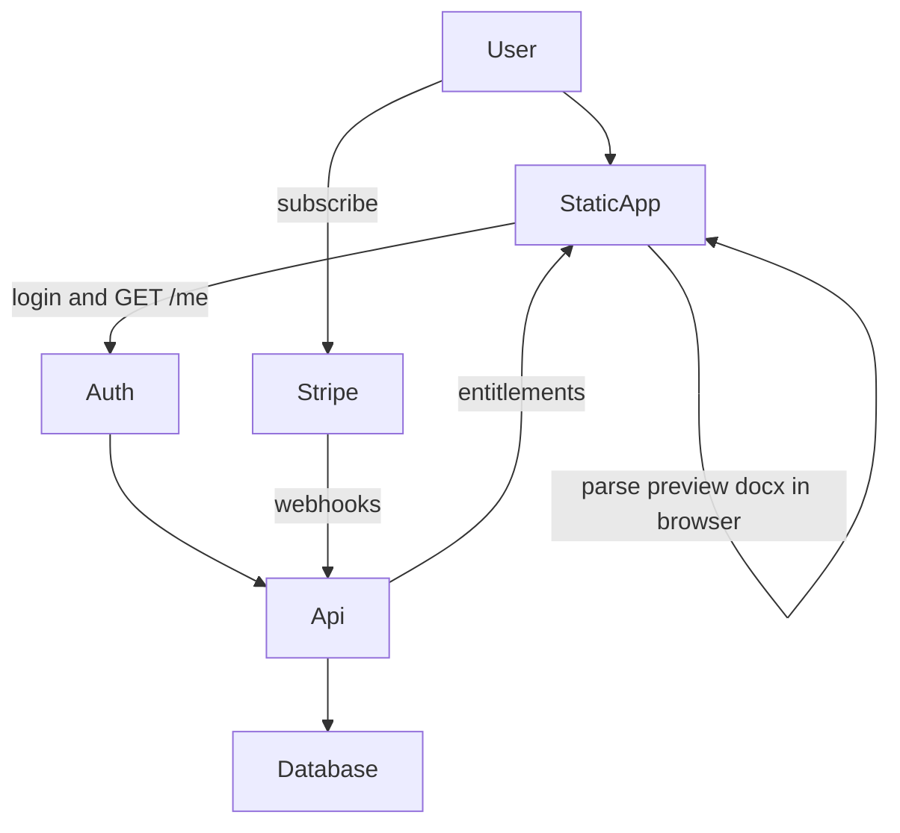

# SaaS architecture

Status: **planned**. Conversion in the current app is 100% client-side. This document is the intended split when we add subscriptions.

## Principle

**Paste never needs to leave the browser.** The backend answers: “who is this, what plan, how many conversions left?” It does not parse LaTeX.

## Pieces

| Piece | Job | Notes |
| --- | --- | --- |
| Static app | Converter UI + `docx` in the browser | Same Vite app; GitHub Pages or Cloudflare/Netlify |
| Auth | Login (email or Google/GitHub) | Clerk, Supabase Auth, or Auth0 — pick in DECISIONS.md when we implement |
| Database | User id, plan, period end, usage counters | Do **not** store pasted documents |
| Stripe | Checkout + Customer Portal | Webhooks update plan; never handle raw cards |
| Small API | `GET /me`, optional `POST /usage` | No LaTeX body required |

## Entitlements (app)

After Convert (or before Download / Copy):

- If anonymous / free over quota → allow preview maybe, block export, CTA to subscribe
- If Pro → export as today

Exact limits: [PRICING.md](PRICING.md).

## Hosting sketch (not locked)

- App: static host (Pages is fine for the converter; auth callbacks need allowed origins)
- API: one small Node or serverless project (separate folder later, e.g. `server/` or a second repo)
- Secrets: Stripe keys and auth secrets **only on the server**

## Image OCR (future, not now)

Would require a **backend + vendor** (e.g. Mathpix) or self-hosted model. API keys must not live in the browser. Privacy copy must change. See ROADMAP.md.

## Out of scope until decided

- Sending document content to an LLM
- Electron / Word add-in (possible later; same document model)
- Automatic error telemetry (the free app captures silently on-device; **Send error report** emails the pasted document and failed LaTeX to the operator via FormSubmit). A future `POST /errors` on the SaaS API may replace FormSubmit — only after a DECISIONS.md entry.
